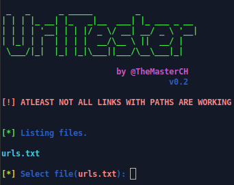

# URL-Tester



# Table of contents:
* [General Information](#general-info)
* [Features](#features)
* [Installation](#installation)
* [Disclaimer](#disclaimer)
* [Credits](#credits)
* [Social Media](#social-media)
* [Bug Report](#bug-report)

# General Information

  This is an simple urltester which is checking the header of every request to the given website and saves it in file. 
  You only need URLs, then paste it with ```nano urls.txt``` into the urls.txt file, and then start it.
  
  
  ✅ Live : Website Works 100%
  
  
  ⚠️ Bad Connection : Website Works 50% (Need To Check By Yourself)
  
  
  ↩️ Redirects : Website works, but it redirects to the new domain.
  
  
  🛂 DDoS Guard : Website Works But Cloudflare Or Any Other Anti-DDoS Service Is Forcing Us To Wait
  
  
  ❌ Dead : Website Is Not Reachable - Sometimes it's an error because any other DDoS Guards are on the website.

# Features

* Easy-To-Use
* Fast Checker
* Test URLs For : _Live, Bad Connection, DDoS Guard, Redirects or Dead_
* Saves Results

# Disclaimer

  This Disclaimer is just copy&paste.

  Use this tool for purposes only .:-) 🕵️‍♂️
  If you do any illegal attacks, i am not responsible for your tasks.
  Use this tool correctly, and do not re-upload it on your github repository without permissions.

# Installation

  You can use linux or termux for this:
  
  ```pkg install curl```
  
  ```git clone https://github.com/rebl0x3r/urltester.git```
  
  ```cd pr0xyscr4p3r && chmod +x urltester.sh```

  Run:
  
  ```bash urltester.sh```

  Output files in same directory saved as:
  - ```live.txt```
  - ```bad_con.txt```
  - ```ddos_guard.txt```
  - ```redirects.txt```
  - ```dead.txt```

# Credits

_Channels :_ 


[LeakerHounds](https://t.me/LeakerHounds)

[ViperZCrew](https://t.me/ViperZCrew)
         
[Deepwaterleaks](https://t.me/deepwaterleaks2)
               
               
_Coder & Contact :_
  
[TheMasterCH](https://t.me/mrblackx2_0)

# Bug Report
  If you found any bug or issue, pless go [here](https://github.com/rebl0x3r/urltester/issues)
  You can also request an update.
